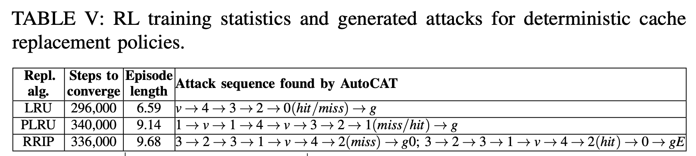

# Compare efforts of training with different replacement policies


We compare the attack patterns found in Table V and epochs need for different replacement policies.




First, go to the directory.

```
cd ${GIT_ROOT}/src/rlmeta
```

To train a config in Table V, use the following script:

```
$ python train_ppo_attack.py env_config=<NAME_OF_THE_CONFIG>
```

There are 17 configs in Table V, and we have ```hpca_ae_exp_5_lru```, ```hpca_ae_exp_5_plru```, ..., ```hpca_ae_exp_5_rrip``` correpondingly, replace ```<NAME_OF_THE_CONFIG>``` with these.

Use ```Ctrl+C``` to interrupt the training, which will save a checkpoint in the given path.

To extract the attack pattern from the checkpoint, use the following command (replace ```<NAME_OF_THE_CONFIG>``` and ```<ABSOLUTE_PATH_TO_CHECKPOINT>```) correspondingly.

```
$ python sample_attack.py  env_config=<NAME_OF_THE_CONFIG> checkpoint=<ABSOLUTE_PATH_TO_CHECKPOINT>
```

Since the training takes some time, we provide pretrained checkpoints in the following directory ```checkpoint```. 

To reproduce the attack sequence in the Table  for LRU, use the following command.

```
$ python sample_attack.py  env_config=hpca_ae_exp_5_lru checkpoint=${GIT_ROOT}/src/rlmeta/data/table5/exp_1/hpca_ae_exp_5_lru/ppoagent.pth
```
To reproduce the attack sequence in the Table  for PLRU, use the following command.
```
$ python sample_attack.py  env_config=hpca_ae_exp_5_plru checkpoint=${GIT_ROOT}/src/rlmeta/data/table5/exp_1/hpca_ae_exp_5_plru/ppoagent.pth
```
To reproduce the attack sequence in the Table  for RRIP, use the following command.
```
$ python sample_attack.py  env_config=hpca_ae_exp_5_rrip checkpoint=${GIT_ROOT}/src/rlmeta/data/table5/exp_1/hpca_ae_exp_5_rrip/ppoagent.pth
```


