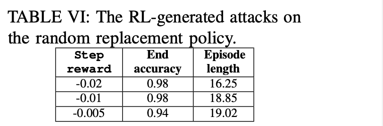

# Table VI: random replacement policies


We compare the attack patterns found in Table VI and epochs need for different rewards used in random replacement policies.




First, go to the directory.

```
cd ${GIT_ROOT}/src/rlmeta
```

To train a config in Table VI, use the following script:

```
$ python train_ppo_attack.py env_config=<NAME_OF_THE_CONFIG>
```

There are 17 configs in Table V, and we have ```hpca_ae_exp_6_0```, ```hpca_ae_exp_6_0002```, ..., ```hpca_ae_exp_6_0005```, ```hpca_ae_exp_6_001```, ```hpca_ae_exp_002``` correpondingly, replace ```<NAME_OF_THE_CONFIG>``` with these.

Use ```Ctrl+C``` to interrupt the training, which will save a checkpoint in the given path ```src/rlmeta/output/<DATE>/<TIME>/ppo_agent-<X>.pth``` and corresponding training logs in ```src/rlmeta/output/<DATE>/<TIME>/train_ppo_attack.log```. 

We only need to look at the ```train_ppo_attack.log``` to figure out the end accuracy and episode length.

Since the training takes some time, we provide pretrained checkpoints in the following directory ```src/rlmeta/data/table5```. For each folder, we include the ```ppo_agent-X.pth``` which is the last checkpoint in the training processes, we also include the training logs.

To reproduce the attack sequence in the Table for each

```
$ python sample_attack.py  env_config=hpca_ae_exp_5_1 checkpoint=${GIT_ROOT}/src/rlmeta/data/table4/hpca_ae_exp_5_1/ppoagent.pth
```

We also provide the training logs corresponding to the checkpoint.

To calculate the epochs to coverage

```
$