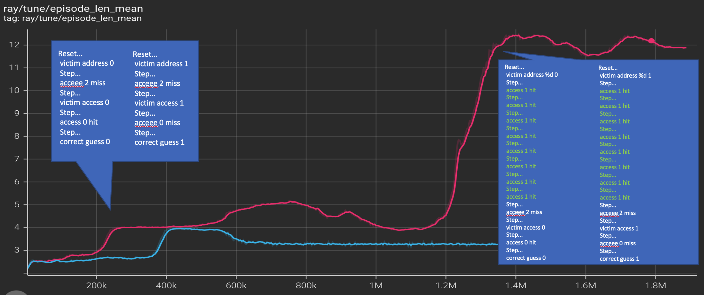
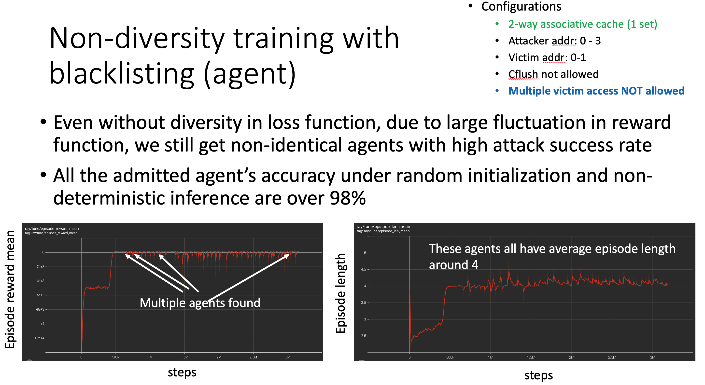

# attack pattern extraction from agent checkpoint

To extract patterns from a checkpoint of an agent, use the following command
```
$ python replay_checkpoint.py <path_to_the_checkpoint>
```
For example
```
$ python replay_checkpoint.py /home/mulong/ray_results/PPO_cache_guessing_game_env_fix_2022-02-01_10-16-10exoo_y_h/checkpoint_000551/checkpoint-551
```
will out put the attack seqeunce on screen.  
```
 Reset... 
 victim address %d 0 
 Step... 
 acceee 2 miss 
 Step... 
 victim access 0 
 Step... 
 access 0 hit 
 Step... 
 correct guess 0 
```
It will also generate '''temp.txt''' which looks like the following format

```
[(victim_addr,[(action, obs), ...], correctness)]
```
which represents for victim address with `victim_addr`, the agent generate `[(action, obs), ....]` sequences.

For example
```
[(0, [(34, 1), (4, 2), (2, 0), (56, 2)], True),
 (1, [(34, 1), (4, 2), (2, 1), (27, 2)], True)]
```
Currently, the action is a number representing a specific action in the action space, which is defined in `parse_action()` in `cache_guessing_game_env_impl.py`.


To extract all patterns from the all checkpoints use the following command

```
$  ./extract_pattern.sh <path_to_directory_of_the_log>
```
For example

```
$  ./extract_pattern.sh /home/mulong/ray_results/PPO_cache_guessing_game_env_fix_2022-02-01_10-16-10exoo_y_h/
```

It will generate `temp.txt` file under current directory, which includes entries of attack patterns. For example
```
[(0, [(34, 1), (4, 2), (1, 0), (56, 2)], True),
 (1, [(34, 1), (4, 2), (1, 1), (27, 2)], True)]
[(0, [(34, 1), (4, 2), (2, 0), (56, 2)], True),
 (1, [(34, 1), (4, 2), (2, 1), (27, 2)], True)]
[(0, [(34, 1), (15, 2), (2, 0), (56, 2)], True),
 (1, [(34, 1), (15, 2), (2, 1), (27, 2)], True)]
[(0, [(33, 1), (15, 2), (2, 0), (56, 2)], True),
 (1, [(33, 1), (15, 2), (2, 1), (27, 2)], True)]
[(0, [(33, 1), (20, 2), (2, 0), (56, 2)], True),
 (1, [(33, 1), (20, 2), (2, 1), (27, 2)], True)]
[(0, [(35, 1), (20, 2), (2, 0), (56, 2)], True),
 (1, [(35, 1), (20, 2), (2, 1), (27, 2)], True)]
 ...
```

The classification task can be performed based on these traces. Currently, we distinguish whether two models/agents/policies are the same model/agent/policy by checking the pattterns generated by the agents for each possible secret, if there is one pattern different then we see these two models/agents/policies as different, see `is_same_agent()` in `test_custom_policy_diversity_works.py`. A more principled classifier integrating experts knowledge on types of side channel attacks would greatly help the diversity-driven agent to be more efficient in discoverying different attacks. 

`/home/mulong/ray_results/PPO_cache_guessing_game_env_fix_2022-02-01_10-16-10exoo_y_h` path corresponds to checkpoints of the following  with patterns in `pattern-exoo_y_h.txt`.

`/home/mulong/ray_results/PPO_cache_guessing_game_env_fix_2022-01-30_20-11-17ixofdheb` path corresponds to checkpoints of the following  with patterns in `pattern-ixofdheb.txt`.